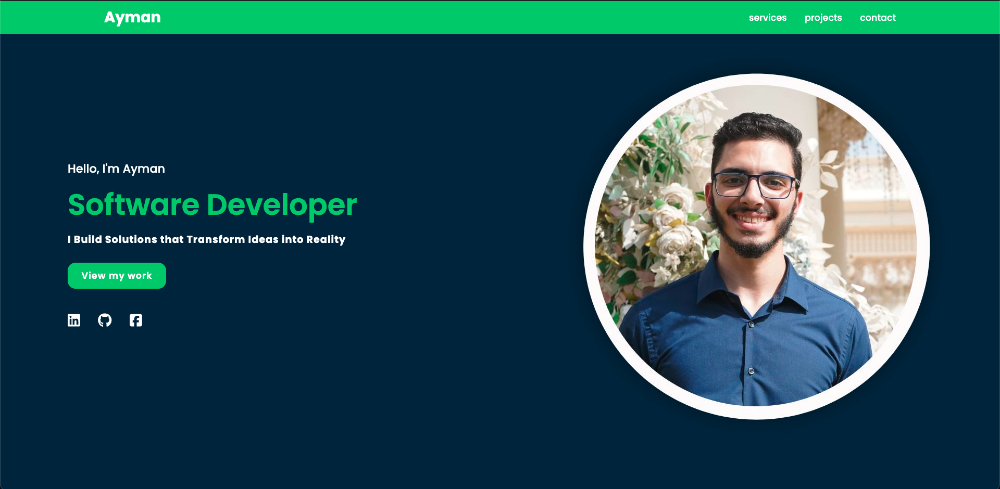
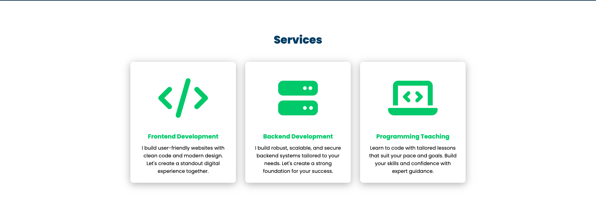
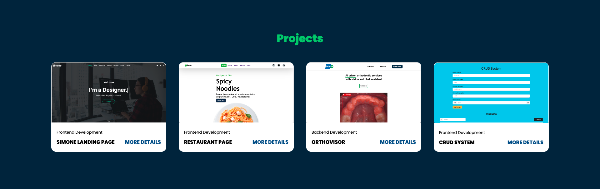
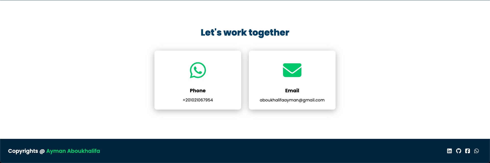
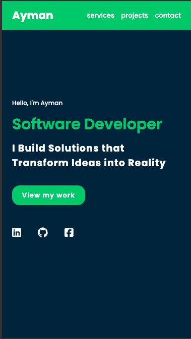
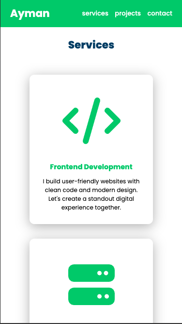
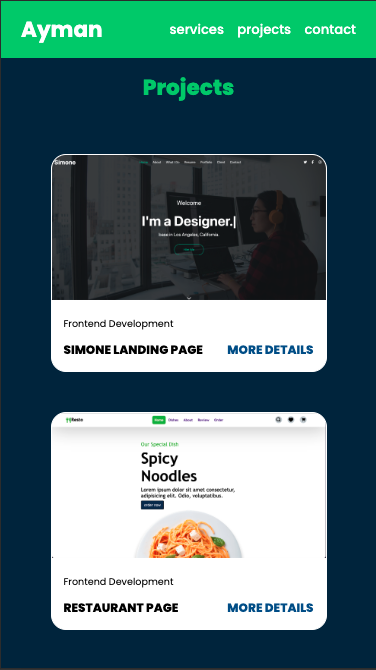
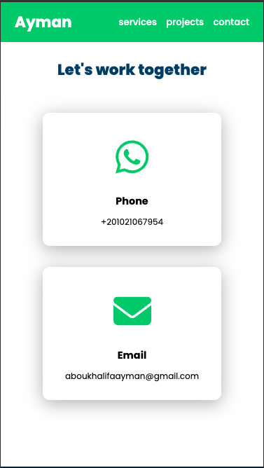

# 🌟 Ayman's Personal Portfolio Website 🌟

## Live Demo
Explore my personal portfolio website [here](https://ayman17.github.io/Ayman-Aboukhalifa/)!

## Project Description
Welcome to my personal portfolio website! This site showcases my skills, projects, and achievements as a developer. Built using HTML and CSS, it is fully responsive, ensuring a seamless experience across devices. Explore my projects, learn more about my background, and get in touch with me for opportunities or collaborations.

## Features
- **Responsive Design**: The website is optimized for mobile, tablet, and desktop devices using custom CSS and media query.
- **Portfolio Section**: Displays key projects with descriptions and links.
- **Services Section**: I offer a range of services to help bring your ideas to life. 
- **Contact Section**: Includes a contact form and links to my social media profiles.

## Screenshots
### Desktop View

### Mobile View

## Future Improvements
- Add a blog section to share insights on web development and coding practices.
- Implement a dark mode toggle for user customization.
- Add About me section

## Contact Information
Feel free to reach out to me for any opportunities or collaborations:

- Email: [aboukhalifa@gmail.com](mailto:aboukhalifa@gmail.com)
- LinkedIn: [Ayman on LinkedIn](https://www.linkedin.com/in/ayman-aboukhalifa-03b841204/)
- GitHub: [Ayman's GitHub](https://github.com/Ayman17)
